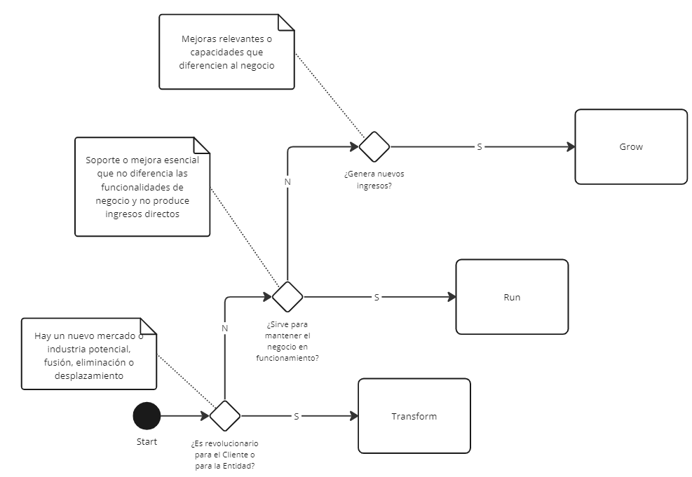

<a href="../../">Inicio</a> > <a href="../conceptos_es#explicación">Conceptos </a> > Clasificación Proyectos Gartner

---

# 🗃️ Clasificación Proyectos Gartner

 

---

# Grow
Dentro de esta categoría se encontrarían aquellas acciones desarrolladas para mejorar el rendimiento de la empresa en los mercados y segmentos de clientes existentes, con las propuestas de valor ya establecidas.

!!! example "Ejemplo"
    La mejora de un producto o servicio, la creación de un nuevo canal de ventas para una línea de producto ya existente o la mejora de resultados en la cadena de suministros de una empresa.

# Run
A este grupo pertenecerían las actividades ejecutadas que son esenciales en el día a día de la compañía para su funcionamiento, pero que no servirían para diferenciar a esa compañía del resto, en términos de misión y valores definidos.

!!! example "Ejemplo"
    La actualización de servidores para eliminar periodos no planificados de inactividad.

   
# Transform
Por último, agruparíamos bajo este epígrafe las actividades desempeñadas para introducirse en nuevos mercados, con nuevos productos o servicios que sirvan a nuevos segmentos de clientes y a través de nuevas propuestas de valor.

!!! example "Ejemplo"
    La puesta en marcha del web-based service iTunes por Apple.

## Enlaces
- [💡 Idea Registro](../idea/idea.registro_es.md)
- [🏗️ Proyecto Establecimiento](../proyecto/proyecto.Registro_es.md)

---

  

    👈 <a href="../conceptos_es">Conceptos </a>
  

---

---
MAPFRE © 2024

