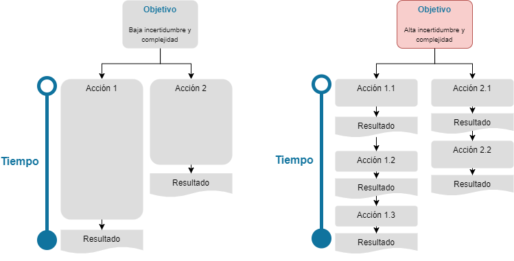
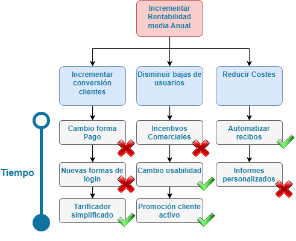

<a href="../../">Inicio</a> > <a href="../conceptos_es#explicación">Conceptos </a> > División Trabajo

---

## 🗃️ División de trabajos

Dependiendo del nivel de volatibilidad, incertidumbre, complejidad o ambiguedad ([VUCA](https://hbr.org/2014/01/what-vuca-really-means-for-you)), la decisión para abordar trabajos puede variar. 

- Volatilidad:
  - Determinar la visión común para el equipo.
  - Buscar oportunidades de desarrollo rápidas.
  - Desarrollar modelos ágiles.
- Incertidumbre:  
  - Intentar recabar información rápidamente de los efectos del plan de acción ejecutado.
  - Definir una visión para diferentes escenarios
  - Mejorar la toma de decisiones de manera rápida
- Complejidad:
  - Adquirir conocimiento experto del problema
  - Implementar prácticas y desarrollos flexibles y continuos
  - Analizar los riesgos y priorizar los más relevantes en cada situación.
- Ambiguedad:
  - Adaptar a la situación
  - Experimentar con escenarios alternativos 
  - Flexibilizar el desarrollo del negocio

 

- Ejemplo división de trabajos
 

## Enlaces
- [💡 Idea Aprobación](../idea/idea.aprobacionRechazo_es.md)
- [🏗️ Proyecto Establecimiento](../proyecto/proyecto.Registro_es.md)

---

  

    👈 <a href="../conceptos_es>Conceptos </a>
  

---

---
MAPFRE © 2024
