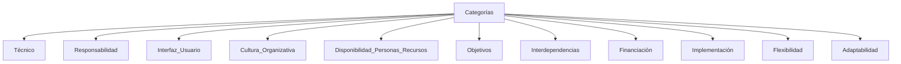

<a href="../../">Inicio</a> > <a href="../conceptos_es#explicación">Conceptos </a> >Guía Gestión Riesgos

---

# 🗃️ Guía Gestión Riegos

## Explicación

---
- Los riesgos identificados dentro del proyecto, quedarán registrados y gestionados en la Herramienta Corporativa de Gestión de Proyectos
- La Normativa de Gestión de Riesgos describe la manera en que se estructurará y realizará la Gestión de Riesgos asociadas al proyecto.
- La gestión de Riesgos se compone de: 
  - Categorías de Riesgos
  - Definiciones de Probabilidad e Impacto
  - Matriz de Probabilidad e Impacto

## Categorías
- Las Categorías de Riesgo proporcionan una estructura que asegura un proceso completo de identificación sistemática de los riesgos con un nivel de detalle coherente.

| Categorías| Definición|
|-----------|-----------|
|**Técnico**|La tecnología del proyecto no se ha probado y son obligatoriosnuevos conocimientos internos o externos.|
|**Responsabilidad**|La responsabilidad o el patrocinio no está claramente identificado y comprometido.|
|**Interfaz Usuario**|la interfaz de usuario (IU) se define de forma incorrecta.|
|**Cultura organizativa**|El proyecto requiere cambios en la estructura organizativa, los procesos empresariales, los procedimientos o las políticas.|
|**Disponibilidad de Personas o Recursos**|La disponibilidad de personas o recursos internos es incierta y se requieren personas o recursos externos.|
|**Objetivos**|Los requisitos, los objetivos, el alcance y los beneficios son irracionales, poco claros y no se pueden medir ni verificar.|
|**Interdependencias**|El proyecto depende de otros proyectos, sistemas, aplicaciones o productos.|
|**Financiación**|La financiación del proyecto no se ha adjudicado o está disponible con limitaciones.|
|**Implementación**|Existen incertidumbres relativas al esfuerzo de implementación y la aceptación del usuario.|
|**Flexibilidad**|El proyecto no se comparta de manera flexible a las necesidades funcionales demandadas.|
|**Adaptabilidad**|La escalabilidad no estaría asegurada.|

## Probabilidad e impacto de los Riesgos
- Con el fin de establecer la prioridad de los riesgos se toman en cuenta la probabilidad de ocurrencia de los mismos y el impacto que cada uno tiene sobre el proyecto. 
  - **Probabilidad**:
    - _Alta_: mayor al 70%.
    - _Media_: mayor al 30% y menor al 70%.
    - _Baja_: menor al 30%.
  - **Impacto**:
    - _Alto_: afecta a más del 25% del proyecto.
    - _Medio_: afecta entre un 10%-25% del proyecto.
    - _Bajo_: afecta a menos de un 10% del proyecto
   
## Matriz de Probabilidad e Impacto
- Evaluar los riesgos:
  - **Identificar**: decidir sobre qué riesgos se actúa.
  - **Priorizar**: el objetivo es saber dónde centrar el esfuerzo de la Gestión de Riesgos.
- Matriz de probabilidad e impacto:

| | Impacto Bajo|Impacto Medio|Impacto Alto|
|-|-----------|---------------|------------|
|**Probabilidad Alta**|🟠Prioridad Media|🔴Prioridad Alta|🔴Prioridad Alta|
|**Probabilidad Media**|🟢Prioridad Baja|🟠Prioridad Media|🔴Prioridad Alta|
|**Probabilidad Baja**|🟢Prioridad Baja|🟢Prioridad Baja|🟠Prioridad Media|

|Prioridad|Descripción|
|---------|-----------|
|**🔴Prioridad Alta**|Requiere tratamiento inmediato. Se priorizará en función de los cambios bloqueantes.|
|**🟠Prioridad Media**|Requiere tratamiento en el menor plazo posible, pero sin ser inmediato.|
|**🟢Prioridad Baja**|Puede ser tratado durante los cauces habituales del seguimiento del proyecto, sin carácter excepcional.|

## Enlaces
- [💡 Idea Aprobación](../idea/idea.aprobacionRechazo_es.md)
- [🏗️ Proyecto Planificación](../proyecto/proyecto.Planificacion_es.md)
- [🏗️ Proyecto Seguimiento](../proyecto/proyecto.Seguimiento_es.md)
- [🏗️ Proyecto Gestión del Cambio](../proyecto/proyecto.GestionCambio_es.md)
- [🏗️ Proyecto Cierre](../proyecto/proyecto.Cierre_es.md)

---

  

    👈 <a href="../conceptos_es">Conceptos </a>
  

---

---
MAPFRE © 2024
