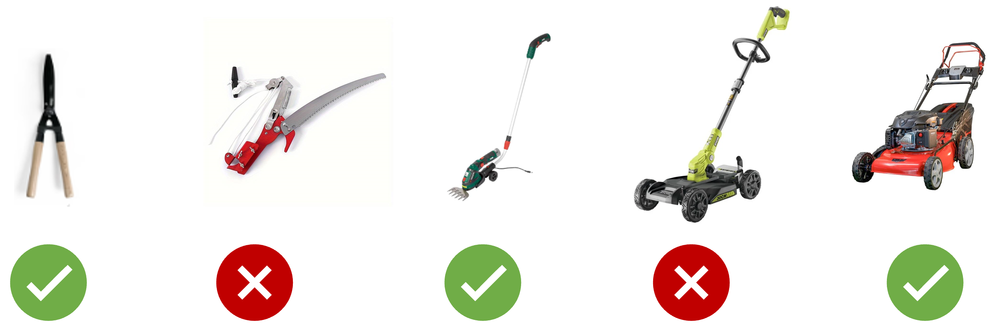

<a href="../../">Inicio</a> > <a href="../conceptos_es#explicación">Conceptos </a> > Mínimo Producto Viable (MPV)

---

## 🗃️ Mínimo Producto Viable (MPV)

- Forma de entrega cuando hay mucha incertidumbre y se necesitan verificar rápidamente hipótesis o funcionalidad novedosa y aprender del negocio.
- Desarrollar un producto, plataforma, aplicación o sistema minimizando gastos y con una continua validación de las necesidades reales.
- Es una versión simple pero completamente operable de lo que se quiere desarrollar.
- En un periodo corto se obtiene un resultado funcional que se prueba con clientes finales en entornos de producción validando la funcionalidad para continuar o descartar la propuesta.
- Características de un MPV:
  -  Valioso: tienen valor por sí sólo y ofrece soluciones (aunque parciales) a los clientes que usan el producto, plataforma, aplicación o sistema.
  -  Usable: tiene los estándares de diseño, calidad y seguridad establecidos en la entidad, puede existir deuda técnica, pero debe ser controlada y equilibrada.
  -  Factible: se puede utilizar y ejecutar en entornos productivos, aunque puede ser que para colectivos o clientes controlados (early adopters).
  -  Innovador: Ofrece algo novedoso que genera entusiasmo y enganche para convertirse en un hecho diferenciador
-  Evolución a través del tiempo:
  - La liberación del conjunto de características de MPV tiene que ser continua.
  - Proporciona pequeñas variaciones a lo largo del tiempo
  - Con el _feedback_ se comprueba la validad o no de las funcionalidades ofrecidas.
  - No siempre son exitosas, la tolerancia al fallo se debe tomar como aprendizaje, no como castigo.

## Enlaces
- [💡 Idea Aprobación](../idea/idea.aprobacionRechazo_es.md)
- [🏗️ Proyecto Establecimiento](../proyecto/proyecto.Registro_es.md)
- [🏗️ Proyecto Planificación](../proyecto/proyecto.Planificacion_es.md)

---

  

    👈 <a href="../conceptos_es">Conceptos </a>
  

---

---
MAPFRE © 2024
