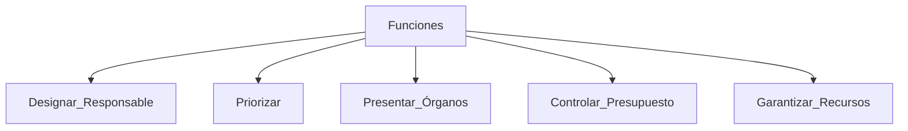
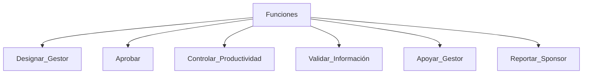
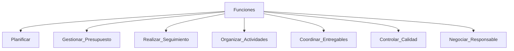
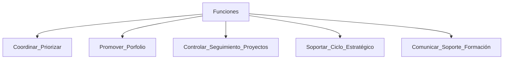
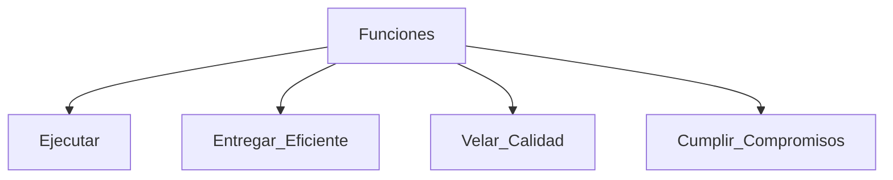

<a href="../../">Inicio</a> > Roles

---

# 👥 Roles
 Roles que participan en la capa de coordinación tanto en [💡Idea](../idea/idea.proyecto_es.md) como [🏗️Proyecto](../proyecto/proyecto_es.md) se organizan en:

## Sponsor
Rol único, reporta a la capa de gobierno y participa en los comités.

Se encarga de:

-  Designar el Responsable.
-  Determinar la importancia relativa de los proyectos dentro de las iniciativas.
  -  Priorizar las líneas de acción.
  -  Marcar la hoja de ruta para el logro de los objetivos definidos.
-  Presentar en los órganos de Gobierno competentes:
  -   Las Propuestas, cambios y reorientaciones de proyectos.
  -   El resultado de la ejecución de los proyectos en cuanto a entregables e indicadores de impacto.
-  Controlar el cumplimiento del presupuesto asignado.
-  Garantizar los recursos (económicos y humanos) necesarios para la ejecución.
  -  Negociar la capacidad de los equipos de trabajo

## Responsable
Gestiona el día a día y es responsable de la entrega cualitativa del producto. Es conocedor de las técnicas de colaboración y gestión de equipos, estando comprometido con el enfoque de colaboración y cumplimiento de los objetivos. Puede provenir de cualquier área dependiendo del propósito.

Se encarga de:

-  Designar el Gestor.
-  Aprobar de las actividades y presupuesto.
-  Controlar y mantener la productividad
-  Validar la información de seguimiento, asegurando el cumplimiento de objetivos.
-  Apoyar al Gestor en la coordinación y el seguimiento conforme a los criterios de la entidad
-  Reportar al Sponsor las eventualidades, problemas o discrepancias surgidas durante el trabajo. 

## Gestor
Gestiona la idea o el proyecto en el día a día y es responsable de llevar a cabo todos los estudios, controles e implicar a todos los equipos necesarios para desarrollar las hipótesis de los retos y validarlos tanto técnicamente como económicamente.

Se encarga de:

-  Planificar las actividades.
-  Gestionar el presupuesto para desarrollar.
-  Realizar seguimiento de los trabajos: controlar la evolución y el proceso.
-  Organizar y dirigir las actividades de los equipos de trabajo.
-  Coordinar la elaboración de los entregables y proveer información de seguimiento actualizada.
-  Hacer seguimiento de riesgos (Opc S).
-  Controlar la calidad de los entregables y de su documentación.
-  Negociar con el Responsable y Sponsor las eventualidades, problemas o discrepancias surgidas durante el trabajo.

## PMO
El ámbito de actuación de la PMO consistirá principalmente en la gestión del porfolio, donde aportará una doble visión: 

- El seguimiento de la actividad:
  - Tiemplo.
  - Plazo.
  - Costes.
  - Otras variables: valor, calidad.

- La consecución del objetivo del proyecto (output) y de los resultados previstos (outcome).

La PMO contribuirá en el sistema de priorización aportando información que permita, a los implicados en el proceso, identificar cuáles son los proyectos que mejor ayudan a conseguir el reto de forma más rápida y con los menores recursos posibles. 

Proveerá de la información y visión que permita a los responsables asegurar la disponibilidad de los recursos necesarios para ejecutar con éxito toda la carga prevista en el porfolio. 

Se realizará un seguimiento continuo de los proyectos en base a los indicadores de influencia y de consecuencia, para crear una visión dinámica de las prioridades, la asignación de recursos y los presupuestos.

Se encarga de:

-   Participar en el diseño del modelo de gobierno y priorización para la toma de decisiones ágil, bajo un marco metodológico end to end que permita crear visibilidad en todas las capas y dinamizar la ejecución de los proyectos.
-   Promover una gestión del porfolio avanzada, centrada en facilitar la toma de decisiones, garantizando a partir de los criterios de priorización definidos la adecuada priorización de las ideas en los porfolios asociados a los Retos, la adecuada priorización entre portfolios y la evaluación continua, para repriorizar cuando sea necesario.
-   Centralizar la función de control y seguimiento sobre la ejecución de proyectos. Colaborar, junto con el resto de los integrantes en el proceso, en el seguimiento del retorno, a través de los indicadores de consecución y de influencia para ayudar a la toma de decisión en el proceso de priorización.
-   Dar soporte durante todo el ciclo estratégico, garantizando la correcta aplicación de criterios, normativas, procedimientos y de la metodología asociada a la gestión de proyectos formando y dando soporte a los ‘stakeholders’ impactados tanto por el proceso como por la metodología de trabajo.
-   Participar en la comunicación, soporte y formación, en colaboración con Personas y Organización, del modelo de gestión de proyectos y porfolios, así como en el uso de la herramienta corporativa de gestión de proyectos y portfolios para conseguir que la información reflejada en los sistemas sea valiosa para la toma de decisión.

## Equipo
Son los responsables de la obtención de los objetivos marcados en los proyectos​. Parte de los Equipos son expertos en cada una de las especialidades técnicas (negocio y TI) y garantiza que el resultado esté alineado en todo momento con las directrices y políticas que rigen en su ámbito de conocimiento. Promueve mejores prácticas.

Dentro de los equipos existen figuras de Referentes que son expertos que representan al equipo en aspectos de gestión (TI, Data, Seguridad, Legal,...)

Se encarga de:

-  Ejecutar los trabajos a nivel operativo.
-  Entregar eficientemente los trabajos.
-  Velar por la calidad de los trabajos entregados.
-  Cumplir los compromisos fijados.

---

  

    👈 <a href="../../">Inicio</a> 
  

  

---

---
MAPFRE © 2024
