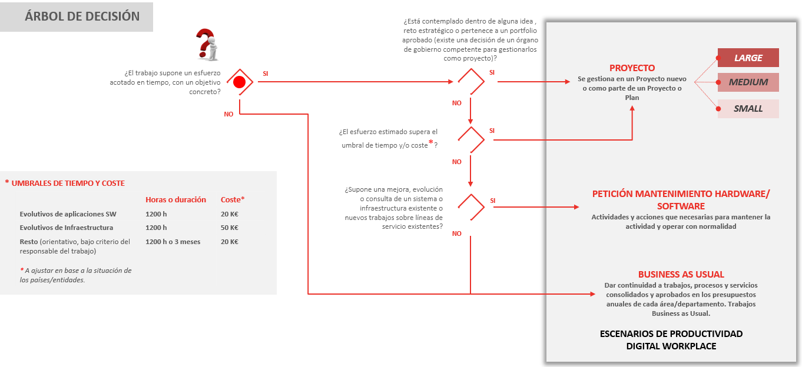

<a href="../../">Inicio</a> > <a href="../conceptos_es#explicación">Conceptos </a> > Tipos de trabajo

---

# 🗃️ Tipos de Trabajo

---
El siguiente diagrama sirve de ayuda para decidir el tipo de trabajo dependiendo de sus características

## Proyecto
- Trabajo que lleve a cabo un objetivo de una Iniciativa estratégica.
- Trabajo operativo con esfuerzo significativo de gestión.
- Creación/parametrización/implantación de una nueva aplicación de negocio.
- Evolución de una aplicación existente a una nueva versión/interface, que suponga cambios significativos.
- Consultoría tecnológica o de negocio.
- Definición e implantación de modelos complejos que supongan una transformación para la operativa de la compañía.

## Peticiones Mantenimiento/Evolutivo

- Cambio o añadir una funcionalidad o de un portal o aplicación demandado por un cliente autorizado.
- Generación de una nueva funcionalidad que modifique la navegación o flujo de una aplicación o portal.

- Consultas, soportes de aplicaciones de negocio o puestas en producción de nuevas releases que deriven en trabajos de un equipo de desarrollo que requieran aprobación por parte del cliente:
  - Pequeños GAP análisis, estudios, opiniones, requerimientos IT,…

- Intercambio de información, extracción de ficheros y listados que requieren programación.

## Trabajo BAU del día a día (Business as usual)

- Generación de contenidos para publicar.
- Seguimiento de presupuestos del área/departamento/aplicación.
- Soporte y consultas de clientes que no requieran aprobación por parte del cliente porque forma parte del catálogo de servicios pre-aprobados.
- Cambio de configuración que no modifique la navegación o flujo de una aplicación o portal.
- Cambio estético o posición de componentes visuales o contenidos.
- Procesos (o partes de un proceso) recurrentes en el tiempo, que no requieren cambios funcionales.

## Enlaces
- [💡 Idea Registro](../idea/idea.registro_es.md)
- [💡 Idea Aprobación](../idea/idea.aprobacionRechazo_es.md)
- [🏗️ Proyecto Establecimiento](../proyecto/proyecto.Registro_es.md)

---

  

    👈 <a href="../conceptos_es">Conceptos </a>
  

---

---
MAPFRE © 2024
